# QProofEVM

**EVM-compatible blockchain consensus Proof-of-Coherence with physically verifiable quantum randomness**

**Authors:** Andrew Kobal & Valentin Sotov (AILAND Group)  
**Date:** August 2025

## **Executive Summary**

This document describes **QProofEVM** — a decentralized L2 network for Ethereum, designed to solve the fundamental problem of the absence of true randomness in blockchain. Modern blockchains rely on pseudo-random generators, which creates predictability and vulnerabilities in critical operations: fair lotteries, fair auctions, protection from MEV attacks, and prevention of oracle manipulations.

**QProofEVM** solves this problem through a new consensus mechanism **Coherence Consensus**, which integrates verified data from physical quantum random number generators (QRNG) directly into the block creation process. The key element of the system is the **Verifier Function** — a deterministic set of statistical tests created based on deep AI analysis of quantum data during the R&D phase. This function can distinguish true quantum data from pseudo-random data by physical markers: quantum correlations, specific noise patterns, and temporal characteristics that cannot be simulated programmatically.

The protocol uses **Miners Committee**: every 2 seconds, 5 miners are randomly selected who collectively generate quantum data through their QRNG, combine them with XOR operation, and verify the result with the Verifier Function. A block is considered valid with participation of ≥3 miners and exceeding the coherence threshold. This approach ensures fault tolerance (works with 40% offline miners) and protection from attacks (requires compromising 3+ miners simultaneously).

The system is built on **modular L2/L3 architecture** based on OP Stack: L1 Ethereum provides final security, L2 QProofEVM provides verified quantum randomness through specialized opcodes (`GET_QUANTUM_DATA`, `QUANTUM_FAIR_SELECT`, `QUANTUM_COMMIT_REVEAL`), and L3 Appchains ensure maximum speed of dApp execution. This allows developers to integrate quantum randomness into existing EVM-compatible contracts with minimal changes, solving practical DeFi problems: eliminating front-running, fair liquidations, protected oracles, and fair resource distribution.

---

## **Table of Contents**

1. [Part 1: Foundation — From AI Analysis to Simple Verification](#part-1-foundation--from-ai-analysis-to-simple-verification)
2. [Part 2: Protocol — Coherence Consensus and Mining](#part-2-protocol--coherence-consensus-and-mining)
3. [Part 3: Economics — Tokenomics](#part-3-economics--tokenomics)
4. [Part 4: Product — QProofEVM](#part-4-product--quantum-evm)
5. [Conclusion](#conclusion)
6. [References](#references)

---

## **Part 1: Foundation — From AI Analysis to Simple Verification**

This section describes the scientific-technical process of creating the **Verifier Function** — the core of our protocol.

**Important role distinction:**

- **Mach-Zehnder Interferometer** is used at the R&D stage for training the AI model and creating the verifier function
- **QRNG (Quantum Random Number Generators)** are used by miners in the main network for data generation

The key idea is to use the power of artificial intelligence (AI) at the research stage to create the most simple and efficient verification function, which can then work with data from any quantum sources in the blockchain.

### **1.1. System Overview**

**QO-RL** (Quantum Observer with Reinforcement Learning) — is a software-hardware complex, i.e., a system consisting of a program (AI) and physical equipment. Its task is to implement active control of the quantum system. The system consists of an **RL-agent** (self-learning algorithm based on **Reinforcement Learning**), which interacts with the physical setup in real time to maintain the state of **coherence**.

> **What is coherence?** This is a key quantum property that can be represented as "purity" or "stability" of the system. When the system is coherent, it behaves predictably according to the laws of quantum mechanics, allowing effects such as interference to manifest. Any external influence (noise, vibrations, temperature fluctuations) destroys this fragile state.
>
> **What is interference?** This is the phenomenon of superposition of two or more waves, where they amplify or weaken each other. In quantum physics, interference shows that a particle behaves as a wave, and it is precisely by the interference pattern that one can judge the preservation of coherence.

### **1.2. Scientific Foundation**

The methodology is based on the conclusions of the work **"Reinforcement Learning for Quantum Control under Physical Constraints"** (Ernst, J. O., et al., 2025). The study shows that RL-agents can effectively control noisy quantum systems, achieving **fidelity** of control above 99.9%.

> **What is fidelity?** This is a metric that shows how much the real quantum state obtained in the experiment corresponds to the desired ideal state. A fidelity of 99.9% means that the system almost perfectly performs the given operation.

**RL4qcWpc** — is an open-source repository that implements RL algorithms for quantum control. Despite the fact that the project is still little known, it is unique as it is the first to combine practical RL tools with quantum control tasks. We will use precisely this, as it is suitable for starting: it provides a ready code base, examples, and proven PPO implementations for quantum environments.

### **1.3. Implementation Stages**

#### **1.3.0. Overview of the entire process: From AI analysis to simple verification**

```mermaid
graph TD
    subgraph STAGE1 ["🎯 Stage 1: Simulation"]
        direction LR
        SIM["🖥️ QuantumEraserEnv<br/>(Interferometer simulator)"] --> RL1["🤖 PPO Agent<br/>(RL4qcWpc)"] --> TRAIN1["📚 Training in simulation<br/>(Maximizing visibility V)"]
    end

    subgraph STAGE2 ["⚙️ Stage 2: Hardware (MVP)"]
        direction LR
        HW["🔬 Physical setup<br/>(Interferometer + QRNG)"] --> RL2["🛡️ Safe RL Agent<br/>(Training on real equipment)"] --> DATA["📊 Data collection<br/>(Good + bad samples)"]
    end

    subgraph STAGE3 ["🔍 Stage 3: Verifier"]
        direction LR
        AI_ANALYSIS["🔬 AI data analysis<br/>(Feature extraction & pattern recognition)"] --> FEATURES["📋 Feature extraction<br/>• Bell correlations<br/>• Frequency spectrum<br/>• Temporal patterns"] --> VERIFIER["✅ Verifier function<br/>(Simple statistical tests)"]
    end

    subgraph PRODUCTION ["🚀 Production"]
        direction LR
        MINERS["⛏️ QRNG Miners<br/>(Data generation)"] --> VERIFY["🔍 Verification<br/>(Verifier function)"] --> BLOCKS["📦 Valid blocks<br/>(C > D_net)"]
    end

    STAGE1 --> STAGE2
    STAGE2 --> STAGE3
    STAGE3 --> PRODUCTION

    style STAGE1 fill:#e3f2fd
    style STAGE2 fill:#fff3e0
    style STAGE3 fill:#e8f5e8
    style PRODUCTION fill:#fce4ec
    style VERIFIER fill:#f3e5f5
```

#### **1.3.1. Stage 1 (PoC): Software simulation**

**Goal:** Validate the RL-agent architecture in an idealized digital environment, without real-world influence.

- **Step 1: Simulation environment (QuantumEraserEnv)**

  Implementation of a **Mach-Zehnder interferometer** simulator with **quantum eraser**. The scientific validity of this approach is confirmed by works similar to the study by Tran, D. M., et al. (2021), where it is shown that complex quantum phenomena, including quantum eraser, can be successfully modeled.

  > **Why is the quantum eraser important?** This element allows demonstrating a fundamental principle: interference (wave behavior) exists only when we have no information about the particle's path. The "eraser" is a mechanism that destroys this information, leading to the restoration of the interference pattern. Thus, by controlling the "eraser," we can directly turn the manifestation of coherence on and off, making this simulation an ideal testing ground for training our RL-agent.

  > **What is a Mach-Zehnder interferometer?** This is an optical device that splits a light beam into two paths and then brings them together again. As a result, light waves interfere, creating a pattern of light and dark bands. This pattern is extremely sensitive to any changes in the light paths.

  The quantum circuit is represented by operators (gates):

  - **Hadamard Gate (H):** Analog of a beam splitter. Puts a qubit into a superposition state.
  - **CNOT Gate:** Entangles two qubits, linking their states.
  - **Controlled Hadamard Gate (H):** Performs the role of information "eraser."

  The environment will be based on the C++ implementation of the **QCSim** simulator, for which a Python wrapper will be created for integration into the standard **Gymnasium** interface.

- **Step 2: RL-agent**
  Uses the **PPO (Proximal Policy Optimization)** algorithm implementation from the **RL4qcWpc** repository.

  > **What is PPO?** This is a modern machine learning algorithm that allows AI to learn through trial and error. PPO is particularly effective for controlling complex systems in real time, making it ideal for controlling quantum setups.

- **Step 3: Training**
  Agent training is conducted. The objective function (reward function) is maximizing the **Visibility (V)** of the interference pattern.

  > **What is visibility (V)?** This is a metric showing how clear and contrasted the interference pattern is. Maximum visibility corresponds to maximum coherence.

#### **1.3.2. Stage 2 (MVP): Hardware integration**

**Goal:** Train the model to control a real physical setup and compensate for real noise.

- **Step 1: Hardware complex**

  - **Base:** Fiber Mach-Zehnder interferometer with PM-fiber and piezoelectric phase modulator.
  - **Control elements:** Electro-optical modulator (EOM) and polarization block.
  - **Control interface:** Data acquisition (DAQ) board — bridge between computer and setup.

- **Step 2: Software interface (Drivers)**
  Python drivers are developed for low-level control of the DAQ board.
- **Step 3: Training (Safe RL)**
  Training is conducted using **Safe RL (Safe Reinforcement Learning)** methodology, so that the AI during self-learning cannot accidentally damage expensive equipment.

  > **What is Safe RL?** This is a special version of machine learning with built-in safety constraints. The algorithm learns to control the system but cannot go beyond safe limits, which is critical for expensive quantum equipment.

- **Step 4: Result**
  The end product of this stage is a high-precision neural network model trained to perfectly recognize and maintain coherence in a specific physical system. This model is ready for the next, key stage.

#### **1.3.3. Stage 3: Verifier Creation**

**Goal:** Turn the knowledge of a complex AI model into a simple, fast, and transparent function.

- **Step 1: Data analysis using machine learning methods**

  We apply feature importance analysis methods to the trained neural network to identify physical markers of quantum processes.

  > **What is feature importance analysis?** This is a method that shows which parts of the input data most influence the neural network's decision. We analyze the trained model and get a list: "Feature A influences 30%, feature B 20%, feature C 15%" and so on. This allows understanding the internal logic of the model.

  The model analyzes two types of data:

  1. **"Good" data:** Gigabytes of information obtained from our real physical setup when the AI-agent maintained maximum coherence in it.
  2. **"Bad" data:** Data generated programmatically (pseudo-random numbers) or obtained from the setup with strong interference.

- **Step 2: Extraction of discriminative features**

  > **What are discriminative features?** These are characteristics that allow distinguishing quantum data from pseudo-random data. For example, if quantum data always has a certain correlation between bits, and pseudo-random data does not, then this correlation is a discriminative feature.

  Applying explainable AI techniques, we determine key features by which the trained model distinguishes quantum and pseudo-random data.

  > **What is explainable AI?** These are methods that explain why the neural network made a specific decision. Instead of the answer "data is quantum," we get "data is quantum because feature X = 0.8, feature Y = 0.3, feature Z = 0.9."

  Gradient analysis and SHAP (SHapley Additive exPlanations) methods reveal the following **physical markers of quantum processes**:

  - **Bell correlations** between distant bits
  - **Specific frequency spectrum** of real quantum devices
  - **Temporal autocorrelations** characteristic of physical processes
  - **Noise patterns** from temperature fluctuations and external influences

#### **Technical analysis methods**

> **What is gradient analysis?** This is a mathematical method that shows the sensitivity of the neural network to changes in each input parameter. We measure: if we change bit #1 to the opposite, the decision changes by 5%; if we change bit #2, then by 15%. This way we find the most important bits.

> **What is SHAP?** This is a method of quantitative analysis of each feature's contribution to the final decision. SHAP gives specific numbers: "Bell correlations added +40% to the 'quantum' decision, frequency spectrum added +25%, temporal patterns added +20%." The sum of all contributions gives the final model assessment.

> **What is PRNG?** This is a Pseudo-Random Number Generator - an ordinary computer program that creates numbers that look random but are actually calculated by a mathematical formula. For example, your computer uses PRNG when it "shuffles" a playlist. PRNG is deterministic - knowing the formula and the initial number, you can predict all subsequent "random" numbers.

> **What are Bell correlations?** This is a physical "fingerprint" of the quantum world. In classical physics, two distant particles cannot be connected. However, in quantum mechanics, they can be "entangled" - a change in one instantly affects the other, regardless of the distance between them. Bell correlations manifest as statistical connections between distant bits that violate classical constraints. When our detector analyzes an array of millions of bits, it looks for precisely these quantum correlations between bits in different parts of the array. PRNG fundamentally cannot create such correlations since they violate the laws of classical physics. This makes the detector exceptionally reliable - it detects quantum physics itself in the data.

- **Step 3: Creating a simple verifier function**

  Based on this list, we write a simple and lightweight software function that sequentially performs several elementary mathematical checks.

  **What this function looks like in human language:**

  > "The `verify(data)` function receives an array of bits as input. It sequentially performs several predefined statistical tests (calculates mean value, variance, autocorrelation, etc.). Each test compares the obtained value with the ideal "reference" value determined during the analysis stage. Based on how close the results of all tests are to the reference, the function calculates and returns a final numerical score — the coherence indicator C. The higher the score, the more the provided data resembles true quantum data."

- **Result:** The end product is a **physically-oriented verifier function** that recognizes physical "fingerprints" of quantum processes. AI is trained on a real interferometer and "remembered" physical features of quantum mechanics that cannot be simulated: quantum correlations, characteristic noise, temporal patterns. The function works with any quantum devices since they all have common physical quantum properties. Its key benefit for the network lies in the combination of **security** and **efficiency**. Since the source code is completely open, any participant can check it for vulnerabilities. At the same time, the function requires minimal computations, allowing network nodes to quickly verify proofs without the need for expensive equipment, maintaining high performance and decentralization.

## **Part 2: Protocol — Coherence Consensus and Mining**

### **2.1. Abstract**

**QProofEVM** — is a decentralized cryptographic system using the **Coherence Consensus** consensus algorithm.

**Connection between R&D and production:**

- At the R&D stage, we use an interferometer to create a universal verifier function
- In the main network, miners use **QRNG** for data generation, which is checked by the same function
- The function is capable of verifying the quality of quantum data regardless of their source

The algorithm requires miners to provide **Proof-of-Coherence** — proof generated by a physical quantum source. Verification is carried out using the **Verifier Function** — a **deterministic** set of statistical tests developed at the R&D stage.

### **2.2. Consensus algorithm: Coherence Consensus (QRNG example)**

- **Miner requirement:** Presence of a physical **Quantum Random Number Generator (QRNG)**.

  > **What is QRNG?** This is a device that generates truly random numbers by extracting them from unpredictable quantum processes, unlike pseudo-random numbers generated by ordinary computers.

- **Equipment availability:** QRNG devices are available for purchase from various manufacturers at a price from **$1,000-$3,000** (IDQuantique, PicoQuant). This makes the entry barrier accessible for private miners, unlike ASIC mining with costs of $10K-$100K+.

- **Verifier Function:** Lightweight software function implementing a set of statistical tests. This function is unified for all network nodes.

### **2.3. Block creation process (Miners Committee)**

```mermaid
flowchart TD
    subgraph INIT ["🎯 Block initialization"]
        START["🎯 New block<br/>(every 2 sec)"]
        SEED["📋 Seed = hash(previous block)"]
        SELECT["🎲 Random selection<br/>5 miners to committee"]
    end

    subgraph GENERATION ["⛏️ Data generation"]
        subgraph COMMITTEE ["Miners Committee"]
            M1["🔧 Miner 1<br/>QRNG data"]
            M2["🔧 Miner 2<br/>QRNG data"]
            M3["🔧 Miner 3<br/>QRNG data"]
            M4["🔧 Miner 4<br/>QRNG data"]
            M5["🔧 Miner 5<br/>QRNG data"]
        end
    end

    subgraph PROCESSING ["🔄 Processing and verification"]
        XOR["🔀 Combining<br/>final_bits = XOR(all data)"]
        VERIFY["🔍 Verifier Function<br/>C = check(final_bits)"]
        CHECK{"🎯 C > D_net?<br/>≥3 miners?"}
    end

    subgraph RESULT ["📦 Result"]
        VALID["✅ Block valid<br/>Rewards to committee"]
        INVALID["❌ Block rejected<br/>Try again"]
        NETWORK["🌐 Block to network<br/>State update"]
    end

    START --> SEED
    SEED --> SELECT
    SELECT --> COMMITTEE

    M1 & M2 & M3 & M4 & M5 --> XOR
    XOR --> VERIFY
    VERIFY --> CHECK

    CHECK -->|Yes| VALID
    CHECK -->|No| INVALID

    VALID --> NETWORK
    INVALID --> START
    NETWORK --> START

    style INIT fill:#e3f2fd
    style GENERATION fill:#fff3e0
    style PROCESSING fill:#f3e5f5
    style RESULT fill:#e8f5e8
    style INVALID fill:#ffebee
    style SEED fill:#bbdefb
    style SELECT fill:#bbdefb
```

1. **Seed (initial value):** We take the hash of the previous block. Seed makes each new attempt unique and links it to the blockchain history.
2. **Committee selection:** Using `seed`, the network randomly selects a committee of 5 miners to create a block.
3. **Data generation by committee (fixed time):** Each miner in the committee:

   - Generates quantum data through QRNG
   - Calculates `hmac_hash = HMAC(key=seed, data=raw_bits)`
   - Creates `verification_bits` using `hmac_hash` as seed for QRNG
   - **Generation time is determined by QRNG characteristics**

   > **What is HMAC?** This is a cryptographic function that creates a unique "fingerprint" of data. It guarantees that no one can forge or change data without detection.

4. **Data combining:** `final_bits = XOR(bits1, bits2, bits3, bits4, bits5)` from all committee participants.

   > **What is XOR?** This is a mathematical operation "exclusive OR." XOR combines data from different sources so that the result preserves physical quantum properties. It's important to note: XOR cannot create quantum correlations out of nothing, but preserves them when present in at least one source. Therefore, even if 2 miners use PRNG and 3 use real QRNG, the XOR result will preserve physical quantum "fingerprints."

5. **Collective verification:** **Verifier function** tests `final_bits` for **physical quantum features** and calculates coherence indicator `C`.

   > **Why is it impossible to deceive the system?** The function is trained to recognize physical features of real quantum processes: quantum correlations between bits, specific noise patterns of devices, temporal characteristics. These physical "fingerprints" cannot be created programmatically - PRNG can imitate statistical properties but cannot reproduce quantum physics.

6. **Block timing (2 sec):**
   - Phase 1: Parallel data generation by miners
   - Phase 2: Data exchange between committee miners
   - Phase 3: XOR combining and verification
   - Phase 4: Block signing (≥3 signatures)
   - Reserve: Network delays and coordination
7. **Consensus:** Block is valid if ≥3 miners participated AND `C > D`.
8. **Distribution:** Valid block is transmitted to the network.

**Miners coordination (Miners Committee):**

- **Random selection:** For each block, a committee of 5 miners is randomly selected
- **Collective generation:** Each miner generates their `verification_bits`
- **Combining:** Final data = `XOR(bits1, bits2, bits3, bits4, bits5)`
- **Consensus:** Block is valid with participation of ≥3 miners from the committee
- **Security:** Attacker needs to control 3+ miners simultaneously

### **2.4. Mining in the QProofEVM ecosystem (Miners Committee)**

- **Basic concepts:**
  - **Committee:** Group of 5 randomly selected miners to create a block.
  - **Block:** Created by committee, valid with participation of ≥3 miners AND `C > D_net`.
  - **Collective reward:** All committee participants receive proportional rewards.
- **Miners Committee process:**
  1. **Selection notification:** Miner receives notification of inclusion in committee for specific `seed`.
  2. **Committee coordination:** 5 selected miners coordinate to create a block.
  3. **Parallel generation:** Each miner independently creates their `verification_bits`.
  4. **Data exchange:** Miners exchange data and create `final_bits = XOR(all data)`.
  5. **Collective verification:** Committee checks `C > D_net` for `final_bits`.
  6. **Block signing:** ≥3 miners sign the block for validation.
  7. **Network submission:** Block with committee signatures is sent to the network.

### **2.5. Protocol parameters and incentives**

- **Difficulty adjustment:** Difficulty (`D_net`) is adjusted so that ~90% of committees successfully create blocks in 2 seconds. If blocks are created faster - `D_net` increases, slower - decreases. This guarantees stable block time regardless of QRNG quality.
- **Decentralization vector:** Incentive is directed towards owning quality equipment, not towards concentration of computational power (PoW) or capital (PoS).
- **Economic accessibility:** QRNG devices are available in a wide price range, making mining accessible to individuals. ROI depends on token price, but entry barrier is significantly lower than Bitcoin ASIC farms.
- **Energy efficiency:** Energy consumption is determined by QRNG device characteristics, not intensive computations.
- **R&D stimulation:** Protocol creates commercial demand for high-quality quantum equipment.

### **2.6. Security through Miners Committee**

**Comprehensive protection using simple methods:**

- **Protection from PRNG attacks:** Requires compromising 3+ miners in one committee simultaneously, which is economically unprofitable
- **Physical security guarantee:** XOR preserves quantum correlations and physical "fingerprints" from honest QRNG. The verifier function looks for precisely these physical features that PRNG cannot create. Result: even with 2 compromised miners out of 5, physical quantum properties remain detectable.
- **Anti-cartel protection:** Random committee selection every 2 seconds makes collusion practically impossible
- **Fault tolerance:** System functions with 40% offline miners (requires only 3 out of 5)
- **Economic security:** Attack requires simultaneous control of 3+ miners in committee, which is economically irrational for participants receiving income from honest mining
- **Audit simplicity:** Use of standard cryptographic primitives ensures complete verifiability

## **Part 3: Economics — Tokenomics**

### **3.1. Economic model principles**

**Tokenomics will be determined after testnet launch and conducting first tests on real QRNG devices.** This will allow calibrating economic parameters based on real data about performance, energy consumption, and miner costs.

**Theoretical foundations of the economic model:**

**Reward structure (Miners Committee):**

- **Collective rewards:** Equal distribution among committee participants
- **Participation proportionality:** Rewards depend on the number of signing miners
- **Quality incentive:** Bonuses for high coherence indicators
- **Entry accessibility:** Equipment requirements accessible to average participant

**Token distribution principles:**

- **Miners** - main share of emission (network stimulation)
- **Development fund** - R&D, infrastructure, protocol improvement
- **Project team** - long-term developer motivation
- **Early participants** - support for first users and investors

**Economic incentives:**

- **Decentralization vector:** Incentive for owning quality equipment, not power concentration
- **Accessible entry barrier:** QRNG devices available in various price categories, making mining accessible to individuals and small businesses
- **Energy efficiency:** Reward for QRNG quality, not energy costs
- **Innovation development:** Creating commercial demand for advanced quantum technologies

**Comparison with traditional mining:**

| Parameter             | Bitcoin ASIC | QProofEVM QRNG |
| --------------------- | ------------ | ---------------- |
| Entry cost            | $10K-$100K+  | $1K-$3K          |
| Energy consumption    | 3000W+       | Low              |
| Technical maintenance | High         | Minimal          |
| Centralization        | High (pools) | Low (committees) |

---

## **Part 4: Product — QProofEVM**

### **4.1. Architecture: Modular L2/L3 approach based on OP Stack**

QProofEVM is implemented as a **modular three-tier system** based on Ethereum and the **OP Stack** framework.

```mermaid
graph TB
    subgraph L1 ["🔒 Level 1: Ethereum (L1)"]
        ETH["Ethereum Mainnet<br/>• Final security<br/>• Proof publication"]
    end

    subgraph L2 ["⚡ Level 2: QProofEVM (L2)"]
        QEVM["QProofEVM<br/>• Coherence Consensus<br/>• QRNG miners<br/>• Verifier function"]
        OPCODES["Quantum Opcodes<br/>• GET_QUANTUM_DATA<br/>• QUANTUM_FAIR_SELECT<br/>• QUANTUM_COMMIT_REVEAL"]
    end

    subgraph L3 ["🚀 Level 3: Appchains (L3)"]
        DEX["🔄 DEX<br/>MEV protection"]
        LENDING["💰 Lending<br/>Fair liquidations"]
        DERIV["📊 Derivatives<br/>Fair auctions"]
    end

    L3 --> L2
    L2 --> L1

    QEVM --> OPCODES
    DEX <--> LENDING
    LENDING <--> DERIV

    L2 -.->|"Randomness<br/>requests"| L3
    L1 -.->|"Data<br/>publication"| L2

    style L1 fill:#ffebee
    style L2 fill:#e3f2fd
    style L3 fill:#e8f5e8
    style QEVM fill:#fff3e0
    style OPCODES fill:#f3e5f5
```

### **4.1.1. Level 1: Security foundation — Ethereum (L1)**

- **Role:** Final settlement and security layer.
- **Rationale:** We "rent" security from Ethereum. Any attack on our ecosystem would require attacking all of Ethereum, making it economically unfeasible.

### **4.1.2. Level 2: Unique functionality layer — QProofEVM (L2)**

- **Role:** Specialized rollup providing verified quantum randomness.

  > **What is a rollup?** This is a blockchain scaling technology that processes thousands of transactions separately and then "rolls" them into one package for recording in the main network. This makes transactions faster and cheaper.

- **Technology:** We take **OP Stack** as a base and add our **Coherence Consensus** to it. The sequencer remains for transaction ordering, while miners with QRNG add verified quantum randomness to each block.
- **Rationale:** OP Stack allows us to easily integrate our unique consensus while maintaining full EVM compatibility.

### **4.1.3. Level 3: Ultra-fast execution layer — Appchains (L3)**

- **Role:** Execution environment for dApps requiring maximum speed.
- **Technology:** Developers launch their own **Appchains** (L3) on top of our L2.
- **How it works:** Appchain works as a classic rollup but appeals to our L2 for finalization. Smart contracts on L3 can seamlessly call the `GET_QUANTUM_DATA` function.
- **Rationale:** Developers get speed, low fees, and access to unique functionality.

### **4.2. Maximum impact quantum opcodes**

Several functions are added to the instruction set (opcode) on L2 and L3:

> **What is an opcode?** These are basic commands that the blockchain virtual machine understands. Like commands for a computer, but for smart contracts. Adding new opcodes expands blockchain capabilities.

#### **Basic function:**

**`GET_QUANTUM_DATA(bytes32 salt)`** - foundation for all quantum operations:

- Takes `salt` parameter from calling contract
- Returns `keccak256(verification_bits + salt)` - 32 bytes
- Each call with different `salt` gives unique result

#### **Specialized maximum impact functions:**

**`QUANTUM_COMMIT_REVEAL(bytes32 commitment)`** - MEV elimination:

- Allows creating hidden bids (commit-reveal schemes)
- Revelation occurs after N blocks with quantum randomness
- **Impact:** Provides protection from front-running and sandwich attacks

**`QUANTUM_FAIR_SELECT(address[] candidates, uint256 count)`** - fair selection:

- Randomly selects participants from candidate list
- **Impact:** Ensures fair lotteries, liquidations, resource distribution

**`QUANTUM_PRICE_ORACLE(bytes32 assetId)`** - protected oracles:

- Generates unpredictable oracle request delays
- **Impact:** Protection from price oracle manipulations

**`QUANTUM_TIME_LOCK(uint256 minTime, uint256 maxTime)`** - unpredictable locks:

- Returns random unlock time in given range
- **Impact:** Vesting and lending protocols with timing attack protection

**`QUANTUM_SHUFFLE(bytes32[] array)`** - fair shuffling:

- Randomly shuffles data array
- **Impact:** Fair DeFi auctions, fair token distribution

### **4.3. Key use cases and DeFi impact**

#### **4.3.1. Solving MEV and Front-Running problem: Creating fair markets**

- **Problem:** Predatory bots (MEV) scan the public mempool and insert their transactions before yours to extract risk-free profit, causing you to get worse prices.

  > **What is mempool?** This is the "waiting queue" for transactions in blockchain. All new transactions first go to mempool, where they wait for inclusion in the next block. MEV bots scan this queue looking for profitable opportunities.

- **Solution: Unpredictable Execution.** DEX on L3 uses `GET_QUANTUM_DATA` to get an unpredictable number that affects the **order matching algorithm** (e.g., random selection among equally priced orders). This makes front-running economically unfeasible since bots cannot predict the exact result.

#### **4.3.2. Preventing cascade liquidations in lending protocols**

- **Problem:** During market volatility moments, dozens of liquidator bots wage "gas wars," trying to be first to liquidate positions, which overloads the network and can cause cascade price crashes.
- **Solution: "Liquidation lottery."** Instead of a "who's faster" race, the protocol uses `GET_QUANTUM_DATA` for **random selection of one liquidator** from all who submitted applications. This eliminates "gas wars" and stabilizes the market.

#### **4.3.3. New AMM mechanisms and Impermanent Loss protection**

- **Problem:** Impermanent Loss for liquidity providers in AMM (e.g., Uniswap) due to predictability of their mathematical formula for arbitrage bots.
- **Solution: Dynamic and unpredictable AMM parameters.** AMM smart contract can use `GET_QUANTUM_DATA` to introduce a **random component** into its parameters (e.g., trading fee), reducing predictability for arbitrage bots and retaining more value in the pool.

## **Conclusion**

The presented modular architecture of QProofEVM, based on a simple and transparent verifier, solves the problem of lack of verifiable randomness in blockchain. Using Ethereum's security, unique Coherence Consensus on L2, and scalable L3 appchains, the system offers a balanced solution to the blockchain trilemma. The next stage is implementing MVP to calibrate the protocol's economic parameters and demonstrate its practical value.

## **Public Statement**

This repository serves as a public disclosure (anti-patent) of the idea of **EVM-compatible blockchain consensus Proof-of-Coherence with physically verifiable quantum randomness**.

The main concept — using AI to create a simple verifier function that can determine the authenticity of quantum data from QRNG miners in an EVM-compatible blockchain — was described here in August 2025 by Andrew Kobal & Valentin Sotov (AILAND Group).

The purpose of this disclosure is to make the idea public so that it remains part of the public domain and cannot be patented in a restrictive manner.

## **License**

This project is released under the **Business Source License 1.1 (BSL)**.  
- Free for research and non-commercial use.  
- Commercial use (including launching networks or tokens) requires a commercial license from the authors.  
- On **August 22, 2030**, the license will automatically convert to **GPLv3+**.  

See [LICENSE.md](LICENSE.md) for full terms.

## **References**

1. **Ernst, J. O., et al. (2025).** _Reinforcement Learning for Quantum Control under Physical Constraints_. Available: https://arxiv.org/abs/2501.14372
2. **Tran, D. M., et al. (2021).** _Experimenting quantum phenomena on NISQ computers using high level quantum programming_. Available: https://arxiv.org/abs/2111.02896v2
3. **RL4qcWpc:** Open-source repository for RL in quantum control. Available: https://github.com/jan-o-e/RL4qcWpc
4. **QCSim QuantumEraser:** C++ implementation of the Quantum Eraser simulation. Available: https://github.com/aromanro/QCSim/blob/master/QCSim/QuantumEraser.h
5. **Ethereum Optimism:** Official Optimism GitHub organization and OP Stack implementation. Available: https://github.com/ethereum-optimism
6. **Optimism Docs:** OP Stack Documentation. Available: https://docs.optimism.io/stack/getting-started
